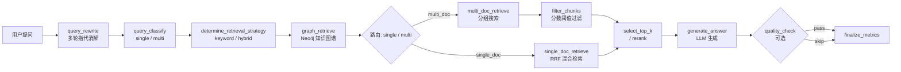
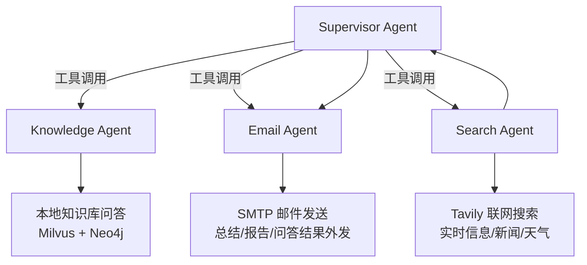

# 🧠 Knowledge Base RAG System 智能 RAG Agent 

> 基于 LangGraph + Milvus + Neo4j 的企业级知识库问答系统，支持多轮对话、混合检索、Rerank、知识图谱、图文解析、Excel 结构化切分，以及 Supervisor 多智能体协作。

<p align="center">
  
  
  
  
  
  
  
</p>


---

## ✨ 功能亮点

- **多轮对话记忆** — 基于 LangGraph checkpointer，重启不丢失，支持指代消解
- **混合检索** — Dense（语义）+ BM25（关键词）+ RRF 融合，可选 Rerank 精排
- **Rerank 支持** — 集成 qwen3-rerank，检索候选池与最终 top-k 独立配置
- **知识图谱（Neo4j）** — LLM 自动抽取实体关系存入 Neo4j，问答时融合图谱检索结果增强上下文
- **图文模式** — 自动提取 PDF/DOCX 图片，与文本切片关联，LLM 回答可展示图片
- **Excel 结构化切分** — 逐 sheet 配置列选择和别名，每行转为 `key=value` 格式，LLM 精准理解表格
- **切分与向量化解耦** — 切分后人工审查，手动触发向量化；大文件分批容错，失败可重试
- **每库独立检索配置** — ranker / top_k / group_size / memory_turns / rerank 参数按知识库隔离
- **Supervisor 多智能体** — 统一入口自动路由到 Knowledge / Email / Search 等子 Agent，支持工具调用协作
- **联网搜索 Agent** — 集成 Tavily Search API，支持实时信息、新闻、天气等外部信息检索
- **邮件发送 Agent** — 集成系统统一 SMTP 发信能力，可将总结、报告、问答结果发送到指定邮箱

---

## 🚀 快速开始

### 1. 启动基础服务

```bash
docker compose up -d
# 首次启动需等待 30-60 秒，直到所有服务变为 healthy
docker compose ps
```

### 2. 配置环境变量

```bash
cd backend
cp .env.example .env
```

| 必填变量 | 说明 |
|----------|------|
| `DASHSCOPE_API_KEY` | 阿里云 DashScope API Key |
| `ALIBABA_CLOUD_ACCESS_KEY_ID` | 阿里云 AccessKey ID（OSS） |
| `ALIBABA_CLOUD_ACCESS_KEY_SECRET` | 阿里云 AccessKey Secret（OSS） |
| `OSS_BUCKET` | OSS Bucket 名称 |
| `PG_HOST` / `PG_USER` / `PG_PASSWORD` | PostgreSQL 连接信息 |
| `TAVILY_API_KEY` | Tavily 联网搜索 API Key（Search Agent 使用） |
| `SMTP_HOST` / `SMTP_PORT` / `SMTP_USER` / `SMTP_PASSWORD` | 系统统一 SMTP 发件邮箱配置（Email Agent 使用） |

> 邮件发送使用系统统一发件邮箱，`SMTP_PASSWORD` 应填写邮箱 SMTP 授权码，不要填写网页登录密码。

### 3. 安装依赖并启动后端

```bash
pip install -r requirements.txt
python -m uvicorn app.main:app --host 0.0.0.0 --port 8000 --reload
```

后端默认运行在 `http://localhost:8000`，启动时自动建表。

### 4. 启动前端

```bash
cd frontend
npm install
npm run dev
```

前端默认运行在 `http://localhost:5173`。

---

## 🗺️ RAG 流水线



### Supervisor 多智能体架构



---

## 🛠️ 技术栈

| 层 | 技术 |
|----|------|
| 后端框架 | FastAPI + Uvicorn |
| Agent 编排 | LangGraph（StateGraph + AsyncPostgresSaver） |
| LLM / Embedding / Rerank | 阿里云 DashScope（Qwen 系列） |
| 向量数据库 | Milvus Standalone |
| 图数据库 | Neo4j 5.x Community |
| 业务数据库 | PostgreSQL |
| 对象存储 | 阿里云 OSS |
| 联网搜索 | Tavily Search API |
| 邮件发送 | SMTP（系统统一发件邮箱） |
| 前端 | Vue 3 + Vite + Element Plus |

---

## 📁 项目结构

<details>
<summary>展开查看</summary>

```
├── docker-compose.yml
├── backend/
│   ├── app/
│   │   ├── api/v1/           # REST API 路由
│   │   ├── core/             # 配置、日志、异常、Prompt
│   │   ├── services/         # 业务逻辑（含 kg_graph_sync_service、rerank_service）
│   │   └── db/               # Repository 层
│   └── agents/
│       ├── knowledge/        # RAG Agent（核心流水线 + 知识图谱检索）
│       ├── specialized/      # Search / Email 等专业子 Agent（Tavily、SMTP 工具）
│       └── supervisor/       # Supervisor Agent（多智能体路由）
├── frontend/
│   └── src/
│       ├── components/       # Vue 组件（含 ExcelCategoryUpload）
│       ├── views/            # 页面视图
│       └── services/         # API 调用（docApi.js）
└── docs/                     # 架构文档 + 截图
```

</details>

---

## 🔧 服务端口

| 服务 | 端口 |
|------|------|
| 后端 API | 8000 |
| 前端 | 5173 |
| PostgreSQL | 5432 |
| Milvus | 19530 |
| Neo4j Browser | 7474 |
| Neo4j Bolt | 7687 |
| Attu（Milvus GUI） | 8080 |
| MinIO Console | 9011 |

---

## ❓ 常见问题

<details>
<summary>展开查看</summary>

**Milvus 启动慢？**
首次启动需初始化 etcd 和 MinIO，等 `docker compose ps` 显示 `healthy` 再启后端。

**Neo4j 首次启动？**
首次启动 Neo4j 约需 60 秒，健康检查通过后即可使用。图表同步在上传文档时可选择"同步图谱"。

**embedding 报 batch size 错误？**
`text-embedding-v3` 单批上限 10 条，`.env` 中 `EMBEDDING_BATCH_SIZE` 请设为 10。

**切分后 job 停在 `chunked`？**
正常，切分与向量化解耦。在文件列表页点"上传向量库"手动触发。

**向量化大文件部分失败？**
系统分批（每批 100 条）独立重试，失败时 job 保持 `chunked`，重新点"上传向量库"可安全重试（upsert 幂等）。

**Rerank 如何开启？**
在知识库检索配置中将 `rerank_enabled` 设为开启，确认 DashScope 已开通 `qwen3-rerank` 权限。多模态知识库自动跳过 rerank。

**上传同名文件报 409？**
设计如此，防止静默覆盖。先在文件列表删除旧版本再重新上传。

**知识图谱如何工作？**
上传文档时勾选"同步图谱"，LLM 自动抽取实体和关系写入 Neo4j。问答时从问题中提取实体，查询 Neo4j 关联切片，与向量检索结果融合生成答案。

**Search Agent 如何联网搜索？**
普通对话 / Multi-Agent 模式下，Supervisor 会根据“搜索、最新、新闻、天气、实时信息”等意图调用 Search Agent。Search Agent 使用 `TAVILY_API_KEY` 调用 Tavily Search API。

**Email Agent 如何发送邮件？**
Email Agent 使用 `.env` 中配置的系统统一 SMTP 邮箱发件。用户只需要在对话中提供收件人、主题和正文，例如“把这份总结发送给 xxx@163.com，主题为项目摘要”。

**邮件能用用户自己的邮箱发送吗？**
当前设计是系统统一发件，不要求普通用户输入邮箱密码。若使用 QQ/163 邮箱，`SMTP_PASSWORD` 请填写 SMTP 授权码。

</details>

---

## License

MIT © 2026 